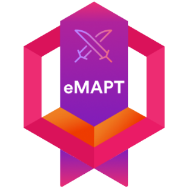
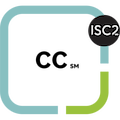

#  Welcome to [Snap!](https://j4m3ee.github.io) git profile 

---

## 🖊️ My Certification 📑

<!--  -->

---

<a href="https://github.com/anuraghazra/github-readme-stats">
  <!-- Change the `github-readme-stats.anuraghazra1.vercel.app` to `github-readme-stats.vercel.app`  -->
  
</a>

- 🔭 I graduated from **king mongkut's institute of technology ladkrabang** (KMITL).
- 🏳️‍🌈 I living in **Thailand.**
- 🌱 I’m currently learning **Cyber Security.**
- 💬 Ask me about anything [Here](https://github.com/j4m3ee/j4m3ee/issues).

 

<b>👛 Wallet Metamask = </b>0x30671C9dA49124F650C324fb2792c6a5A7177274

---

<!-- ## 👌 Skill 📚 -->

    
   
  
  
  
  

<!--
**j4m3ee/j4m3ee** is a ✨ _special_ ✨ repository because its `README.md` (this file) appears on your GitHub profile.

Here are some ideas to get you started:

- 🔭 I’m currently working on ...
- 🌱 I’m currently learning ...
- 👯 I’m looking to collaborate on ...
- 🤔 I’m looking for help with ...
- 💬 Ask me about ...
- 📫 How to reach me: ...
- 😄 Pronouns: ...
- ⚡ Fun fact: ...

credit : https://github.com/swaggytt/swaggytt
-->
